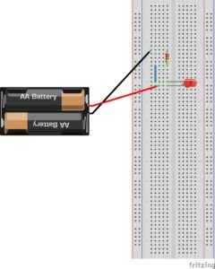

## A simple LED circuit

With the game we learnt 

+ how the electrons travel throught the cables
+ what the battery does
+ how the electrons light the LED
+ what the resistor is used for

So, if we connect a battery on the two edges of a cable, then the electrons will begin to run. If we use this movement effectively we can do a lot of things.

Now we are going to create a simple LED circuit

You can see the image below

Electrons begin from the one battery cable, they go to the resistor, they go to the LED, they turn it on and they end up to the other battery cable, starting over again.

We can observe that electrons leave the battery, they return to it and they leave it again. We will never meet a functioning circuit without a closed loop. It is very helpful to discover these loops when we see a circuit. Thus, we will understand better its operation.

This white thing in the right? This is a breadboard.

Breadboard helps us to position our electronic elements in order to create circuits.

Let’s see the next image

Lines on breadboard are like small cables. Placing two elements on the same line is like connecting them with a cable.

Assemble the above circuit and see the LED turning on. You should use a 100 Ohm resistor.

Your journey to electronics worls has just begun!